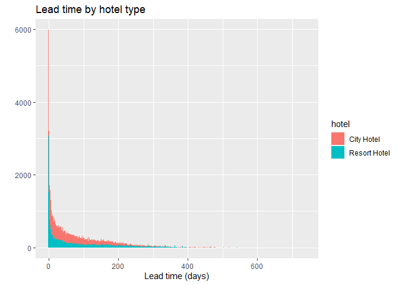

Hotel Bookings Case Study
================
Anna Mándoki
2022-11-10

## 1. Introduction

This case study was inspired by a series of exercises related to the
‘hotel_bookings’ dataset I worked through while I was doing the Google
Data Analytics Professional Certificate course. The dataset contains
booking information a city hotel and a resort hotel, and it is
recommended on
[Kaggle](https://www.kaggle.com/datasets/jessemostipak/hotel-booking-demand)
as an ideal dataset to practice exploratory data analysis (EDA).

My goal with this project is to dive deeper into the data and build a
case study similar to the [Cyclistic Bike-share Case
Study](https://github.com/annamandoki/cyclistic_case_study) and the
[Bellabeat Case
Study](https://github.com/annamandoki/bellabeat_case_study) I did
previously.

In this project I am assuming the role of a junior data analyst working
on the marketing analytics team at an imaginary hotel booking company. I
am going to perform different data cleaning tasks and conduct
exploratory data analysis (EDA) on the dataset in order to identify
hotel booking trends to help shape the company’s marketing strategy
towards a set of goals.

## 2. Ask Phase

### 2.1 Business Objective

The following stakeholder goals and business questions will guide the
analysis:

- Goal 1: Marketing campaign to target people who book early.
  - What group of guests tend to book early?
  - What are the main factors that influence lead time?
- Goal 2: Increase weekend bookings, an important source of revenue for
  the hotel.
  - What group of guests book the most weekend nights?
  - Which season is popular for weekend stays?
- Goal 3: Develop promotions based on different booking distributions.
  - How many of the transactions are occurring for each different
    distribution type?
  - Is the number of bookings for each distribution type different
    depending on whether or not there was a deposit or what market
    segment they represent?
- Goal 4: Prevent cancellations.
  - How many bookings were cancelled out of total?
  - What types of bookings are likely to get cancelled?

Further areas of interest:

- Which countries do customers come from?
- What is the Average Daily Rate (ADR) throughout the year?
- What is the preferred meal plan in each hotel?
- What is the preferred room type in each hotel?

### 2.2 Stakeholders

In a similar real-life scenario stakeholders would include:

- Head of Marketing: a person responsible for the development of
  marketing campaigns
- Marketing Analytics Team: a team responsible for collecting, analyzing
  and reporting data that helps guide the company’s marketing strategy
- Executive Team: company executives who make the final decision on the
  recommended marketing strategy

## 3. Prepare Phase

### 3.1 About the dataset

The dataset consists of one csv file: ‘hotel_bookings.csv’

It contains information on bookings due to arrive between the 1st of
July of 2015 and the 31st of August 2017, including bookings that
effectively arrived and bookings that were cancelled.

The file contains 32 columns with information such as when the booking
was made, lead time, the number of adults, children, and/or babies, meal
plan and guest country of origin among other things.

### 3.2 Dataset location & licence

The dataset was made available on Kaggle: [Hotel booking
demand](https://www.kaggle.com/datasets/jessemostipak/hotel-booking-demand)
by Jesse Mostipak.

The data is originally from the article [Hotel Booking Demand
Datasets](https://www.sciencedirect.com/science/article/pii/S2352340918315191),
written by Nuno Antonio, Ana Almeida, and Luis Nunes for Data in Brief,
Volume 22, February 2019.

The data was downloaded and cleaned by Thomas Mock and Antoine Bichat
for [\#TidyTuesday during the week of February 11th,
2020](https://github.com/rfordatascience/tidytuesday/blob/master/data/2020/2020-02-11/readme.md)

The data was released under this
[licence](https://creativecommons.org/licenses/by/4.0/)

Since this is real hotel data, all data elements concerning hotel, agent
or guest identification were deleted.

### 3.3 Data dictionary

Detailed description of the variables used in the dataset:
[Source](https://www.sciencedirect.com/science/article/pii/S2352340918315191#t0005)

- hotel: type of hotel - Resort hotel or City Hotel
- is_canceled: value indicating if the booking was canceled (1) or not
  (0)
- lead_time: number of days that elapsed between the entering date of
  the booking into the PMS and the arrival date
- arrival_date_year: year of arrival date
- arrival_date_month: month of arrival date
- arrival_date_week_number: week number for arrival date
- arrival_date_day_of_month: day of the month of the arrival date
- stays_in_weekend_nights: number of weekend nights (Saturday or Sunday)
  the guest stayed or booked to stay at the hotel
- stays_in_week_nights: number of week nights (Monday to Friday) the
  guest stayed or booked to stay at the hotel
- adults: number of adults in the booking
- children: number of children
- babies: number of babies
- meal: type of meal booked. Categories are presented in standard
  hospitality meal packages:
  - Undefined/SC – no meal package
  - BB – Bed & Breakfast
  - HB – Half board (breakfast and one other meal – usually dinner)
  - FB – Full board (breakfast, lunch and dinner)
- country: country of origin. Categories are represented in the [ISO
  3166–3:2013 format](https://www.iso.org/iso-3166-country-codes.html)
- market_segment: market segment designation
  - TA = Travel Agents
  - TO = Tour Operators
- distribution_channel: booking distribution channel
  - TA = Travel Agents
  - TO = Tour Operators
- is_repeated_guest: value indicating if the booking name was from a
  repeated guest (1) or not (0)
- previous_cancellations: number of previous bookings that were
  cancelled by the customer prior to the current booking
- previous_bookings_not_canceled: number of previous bookings not
  cancelled by the customer prior to the current booking
- reserved_room_type: code of room type reserved. Code is presented
  instead of designation for anonymity reasons.
- assigned_room_type: code for the type of room assigned to the booking.
  Sometimes the assigned room type differs from the reserved room type
  due to hotel operation reasons (e.g. overbooking) or by customer
  request. Code is presented instead of designation for anonymity
  reasons.
- booking_changes: number of changes/amendments made to the booking from
  the moment the booking was entered on the PMS until the moment of
  check-in or cancellation
- deposit_type: indication on if the customer made a deposit to
  guarantee the booking. Three categories;
  - No Deposit – no deposit was made
  - Non Refund – a deposit was made in the value of the total stay cost
  - Refundable – a deposit was made with a value under the total cost of
    stay.
- agent: ID of the travel agency that made the booking
- company: ID of the company/entity that made the booking or responsible
  for paying the booking. ID is presented instead of designation for
  anonymity reasons
- days_in_waiting_list: number of days the booking was in the waiting
  list before it was confirmed to the customer
- customer_type: type of booking, assuming one of four categories:
  - Contract - when the booking has an allotment or other type of
    contract associated to it
  - Group – when the booking is associated to a group
  - Transient – when the booking is not part of a group or contract, and
    is not associated to other transient (temporary) booking
  - Transient-party – when the booking is transient (temporary), but is
    associated to at least other transient booking
- adr: Average Daily Rate as defined by dividing the sum of all lodging
  transactions by the total number of staying nights
- required_car_parking_spaces: number of car parking spaces required by
  the customer
- total_of_special_requests: Number of special requests made by the
  customer (e.g. twin bed or high floor)
- reservation_status: Reservation last status, assuming one of three
  categories:
  - Canceled – booking was canceled by the customer
  - Check-Out – customer has checked in but already departed
  - No-Show – customer did not check-in and did inform the hotel of the
    reason why
- reservation_status_date: date at which the last status was set. This
  variable can be used in conjunction with the ‘ReservationStatus’ to
  understand when was the booking canceled or when did the customer
  checked-out of the hotel

### 3.4 Credibility, bias and privacy

- Reliable: The data is reliable and fit for use as it is real hotel
  booking data.
- Original: The data originates from real hotels, however pre-processing
  has been made, two datasets were merged into one.
- Comprehensive: The data is comprehensive, contains all critical
  information.
- Current: The data is not current, it is 7 years old as of November
  2022.
- Cited: The data is cited, the name of the authors of the original
  article is mentioned.

Data privacy is ensured: all personally identifying information has been
removed from the data.

### 3.5 Is the data helpful in answering the questions in the business task?

The dataset contains all critical information to identify patterns in
bookings to answer the business questions.

### 3.6 Key steps taken in the Prepare Phase

- Downloaded and stored data on computer
- Identified how the data is organized
- Explored data dictionary
- Took a first look at the data using LibreOffice Calc
- Determined credibility of the data

## 4. Process Phase

### 4.1 Tools

After taking a first look at the data in LibreOffice Calc, I am
switching to RStudio Desktop.

### 4.2 Setting up my environment

``` r
library(tidyverse)
```

    ## ── Attaching packages ─────────────────────────────────────── tidyverse 1.3.2 ──
    ## ✔ ggplot2 3.3.6      ✔ purrr   0.3.4 
    ## ✔ tibble  3.1.8      ✔ dplyr   1.0.10
    ## ✔ tidyr   1.2.1      ✔ stringr 1.4.1 
    ## ✔ readr   2.1.2      ✔ forcats 0.5.2 
    ## ── Conflicts ────────────────────────────────────────── tidyverse_conflicts() ──
    ## ✖ dplyr::filter() masks stats::filter()
    ## ✖ dplyr::lag()    masks stats::lag()

``` r
library(janitor)
```

    ## 
    ## Attaching package: 'janitor'
    ## 
    ## The following objects are masked from 'package:stats':
    ## 
    ##     chisq.test, fisher.test

``` r
library(skimr)
library(lubridate)
```

    ## 
    ## Attaching package: 'lubridate'
    ## 
    ## The following objects are masked from 'package:base':
    ## 
    ##     date, intersect, setdiff, union

### 4.3 Data importing

``` r
hotel_bookings <- read.csv("hotel_bookings.csv")
```

### 4.4 Viewing the data frame

Take a look at the data frame using the `glimpse()` and `head()`
functions.

``` r
glimpse(hotel_bookings)
```

    ## Rows: 119,390
    ## Columns: 32
    ## $ hotel                          <chr> "Resort Hotel", "Resort Hotel", "Resort…
    ## $ is_canceled                    <int> 0, 0, 0, 0, 0, 0, 0, 0, 1, 1, 1, 0, 0, …
    ## $ lead_time                      <int> 342, 737, 7, 13, 14, 14, 0, 9, 85, 75, …
    ## $ arrival_date_year              <int> 2015, 2015, 2015, 2015, 2015, 2015, 201…
    ## $ arrival_date_month             <chr> "July", "July", "July", "July", "July",…
    ## $ arrival_date_week_number       <int> 27, 27, 27, 27, 27, 27, 27, 27, 27, 27,…
    ## $ arrival_date_day_of_month      <int> 1, 1, 1, 1, 1, 1, 1, 1, 1, 1, 1, 1, 1, …
    ## $ stays_in_weekend_nights        <int> 0, 0, 0, 0, 0, 0, 0, 0, 0, 0, 0, 0, 0, …
    ## $ stays_in_week_nights           <int> 0, 0, 1, 1, 2, 2, 2, 2, 3, 3, 4, 4, 4, …
    ## $ adults                         <int> 2, 2, 1, 1, 2, 2, 2, 2, 2, 2, 2, 2, 2, …
    ## $ children                       <int> 0, 0, 0, 0, 0, 0, 0, 0, 0, 0, 0, 0, 0, …
    ## $ babies                         <int> 0, 0, 0, 0, 0, 0, 0, 0, 0, 0, 0, 0, 0, …
    ## $ meal                           <chr> "BB", "BB", "BB", "BB", "BB", "BB", "BB…
    ## $ country                        <chr> "PRT", "PRT", "GBR", "GBR", "GBR", "GBR…
    ## $ market_segment                 <chr> "Direct", "Direct", "Direct", "Corporat…
    ## $ distribution_channel           <chr> "Direct", "Direct", "Direct", "Corporat…
    ## $ is_repeated_guest              <int> 0, 0, 0, 0, 0, 0, 0, 0, 0, 0, 0, 0, 0, …
    ## $ previous_cancellations         <int> 0, 0, 0, 0, 0, 0, 0, 0, 0, 0, 0, 0, 0, …
    ## $ previous_bookings_not_canceled <int> 0, 0, 0, 0, 0, 0, 0, 0, 0, 0, 0, 0, 0, …
    ## $ reserved_room_type             <chr> "C", "C", "A", "A", "A", "A", "C", "C",…
    ## $ assigned_room_type             <chr> "C", "C", "C", "A", "A", "A", "C", "C",…
    ## $ booking_changes                <int> 3, 4, 0, 0, 0, 0, 0, 0, 0, 0, 0, 0, 0, …
    ## $ deposit_type                   <chr> "No Deposit", "No Deposit", "No Deposit…
    ## $ agent                          <chr> "NULL", "NULL", "NULL", "304", "240", "…
    ## $ company                        <chr> "NULL", "NULL", "NULL", "NULL", "NULL",…
    ## $ days_in_waiting_list           <int> 0, 0, 0, 0, 0, 0, 0, 0, 0, 0, 0, 0, 0, …
    ## $ customer_type                  <chr> "Transient", "Transient", "Transient", …
    ## $ adr                            <dbl> 0.00, 0.00, 75.00, 75.00, 98.00, 98.00,…
    ## $ required_car_parking_spaces    <int> 0, 0, 0, 0, 0, 0, 0, 0, 0, 0, 0, 0, 0, …
    ## $ total_of_special_requests      <int> 0, 0, 0, 0, 1, 1, 0, 1, 1, 0, 0, 0, 3, …
    ## $ reservation_status             <chr> "Check-Out", "Check-Out", "Check-Out", …
    ## $ reservation_status_date        <chr> "2015-07-01", "2015-07-01", "2015-07-02…

``` r
head(hotel_bookings)
```

    ##          hotel is_canceled lead_time arrival_date_year arrival_date_month
    ## 1 Resort Hotel           0       342              2015               July
    ## 2 Resort Hotel           0       737              2015               July
    ## 3 Resort Hotel           0         7              2015               July
    ## 4 Resort Hotel           0        13              2015               July
    ## 5 Resort Hotel           0        14              2015               July
    ## 6 Resort Hotel           0        14              2015               July
    ##   arrival_date_week_number arrival_date_day_of_month stays_in_weekend_nights
    ## 1                       27                         1                       0
    ## 2                       27                         1                       0
    ## 3                       27                         1                       0
    ## 4                       27                         1                       0
    ## 5                       27                         1                       0
    ## 6                       27                         1                       0
    ##   stays_in_week_nights adults children babies meal country market_segment
    ## 1                    0      2        0      0   BB     PRT         Direct
    ## 2                    0      2        0      0   BB     PRT         Direct
    ## 3                    1      1        0      0   BB     GBR         Direct
    ## 4                    1      1        0      0   BB     GBR      Corporate
    ## 5                    2      2        0      0   BB     GBR      Online TA
    ## 6                    2      2        0      0   BB     GBR      Online TA
    ##   distribution_channel is_repeated_guest previous_cancellations
    ## 1               Direct                 0                      0
    ## 2               Direct                 0                      0
    ## 3               Direct                 0                      0
    ## 4            Corporate                 0                      0
    ## 5                TA/TO                 0                      0
    ## 6                TA/TO                 0                      0
    ##   previous_bookings_not_canceled reserved_room_type assigned_room_type
    ## 1                              0                  C                  C
    ## 2                              0                  C                  C
    ## 3                              0                  A                  C
    ## 4                              0                  A                  A
    ## 5                              0                  A                  A
    ## 6                              0                  A                  A
    ##   booking_changes deposit_type agent company days_in_waiting_list customer_type
    ## 1               3   No Deposit  NULL    NULL                    0     Transient
    ## 2               4   No Deposit  NULL    NULL                    0     Transient
    ## 3               0   No Deposit  NULL    NULL                    0     Transient
    ## 4               0   No Deposit   304    NULL                    0     Transient
    ## 5               0   No Deposit   240    NULL                    0     Transient
    ## 6               0   No Deposit   240    NULL                    0     Transient
    ##   adr required_car_parking_spaces total_of_special_requests reservation_status
    ## 1   0                           0                         0          Check-Out
    ## 2   0                           0                         0          Check-Out
    ## 3  75                           0                         0          Check-Out
    ## 4  75                           0                         0          Check-Out
    ## 5  98                           0                         1          Check-Out
    ## 6  98                           0                         1          Check-Out
    ##   reservation_status_date
    ## 1              2015-07-01
    ## 2              2015-07-01
    ## 3              2015-07-02
    ## 4              2015-07-02
    ## 5              2015-07-03
    ## 6              2015-07-03

### 4.5 Data cleaning & transformation

As I start cleaning and transforming the dataset, I create a new data
frame to represent the changes: **‘hotel_bookings_v2’** I can always
refer back to the original data frame if needed.

#### 4.5.1 Check duplicated values if any

Count duplicates with `sum()` and `duplicated()`.

``` r
sum(duplicated(hotel_bookings))
```

    ## [1] 31994

#### 4.5.2 Remove duplicates

Remove duplicates using the `distinct()` function.

``` r
hotel_bookings_v2 <- hotel_bookings %>%
  distinct()

glimpse(hotel_bookings_v2)
```

    ## Rows: 87,396
    ## Columns: 32
    ## $ hotel                          <chr> "Resort Hotel", "Resort Hotel", "Resort…
    ## $ is_canceled                    <int> 0, 0, 0, 0, 0, 0, 0, 1, 1, 1, 0, 0, 0, …
    ## $ lead_time                      <int> 342, 737, 7, 13, 14, 0, 9, 85, 75, 23, …
    ## $ arrival_date_year              <int> 2015, 2015, 2015, 2015, 2015, 2015, 201…
    ## $ arrival_date_month             <chr> "July", "July", "July", "July", "July",…
    ## $ arrival_date_week_number       <int> 27, 27, 27, 27, 27, 27, 27, 27, 27, 27,…
    ## $ arrival_date_day_of_month      <int> 1, 1, 1, 1, 1, 1, 1, 1, 1, 1, 1, 1, 1, …
    ## $ stays_in_weekend_nights        <int> 0, 0, 0, 0, 0, 0, 0, 0, 0, 0, 0, 0, 0, …
    ## $ stays_in_week_nights           <int> 0, 0, 1, 1, 2, 2, 2, 3, 3, 4, 4, 4, 4, …
    ## $ adults                         <int> 2, 2, 1, 1, 2, 2, 2, 2, 2, 2, 2, 2, 2, …
    ## $ children                       <int> 0, 0, 0, 0, 0, 0, 0, 0, 0, 0, 0, 0, 1, …
    ## $ babies                         <int> 0, 0, 0, 0, 0, 0, 0, 0, 0, 0, 0, 0, 0, …
    ## $ meal                           <chr> "BB", "BB", "BB", "BB", "BB", "BB", "FB…
    ## $ country                        <chr> "PRT", "PRT", "GBR", "GBR", "GBR", "PRT…
    ## $ market_segment                 <chr> "Direct", "Direct", "Direct", "Corporat…
    ## $ distribution_channel           <chr> "Direct", "Direct", "Direct", "Corporat…
    ## $ is_repeated_guest              <int> 0, 0, 0, 0, 0, 0, 0, 0, 0, 0, 0, 0, 0, …
    ## $ previous_cancellations         <int> 0, 0, 0, 0, 0, 0, 0, 0, 0, 0, 0, 0, 0, …
    ## $ previous_bookings_not_canceled <int> 0, 0, 0, 0, 0, 0, 0, 0, 0, 0, 0, 0, 0, …
    ## $ reserved_room_type             <chr> "C", "C", "A", "A", "A", "C", "C", "A",…
    ## $ assigned_room_type             <chr> "C", "C", "C", "A", "A", "C", "C", "A",…
    ## $ booking_changes                <int> 3, 4, 0, 0, 0, 0, 0, 0, 0, 0, 0, 0, 1, …
    ## $ deposit_type                   <chr> "No Deposit", "No Deposit", "No Deposit…
    ## $ agent                          <chr> "NULL", "NULL", "NULL", "304", "240", "…
    ## $ company                        <chr> "NULL", "NULL", "NULL", "NULL", "NULL",…
    ## $ days_in_waiting_list           <int> 0, 0, 0, 0, 0, 0, 0, 0, 0, 0, 0, 0, 0, …
    ## $ customer_type                  <chr> "Transient", "Transient", "Transient", …
    ## $ adr                            <dbl> 0.00, 0.00, 75.00, 75.00, 98.00, 107.00…
    ## $ required_car_parking_spaces    <int> 0, 0, 0, 0, 0, 0, 0, 0, 0, 0, 0, 0, 0, …
    ## $ total_of_special_requests      <int> 0, 0, 0, 0, 1, 0, 1, 1, 0, 0, 0, 3, 1, …
    ## $ reservation_status             <chr> "Check-Out", "Check-Out", "Check-Out", …
    ## $ reservation_status_date        <chr> "2015-07-01", "2015-07-01", "2015-07-02…

#### 4.5.3 Check NA values

Count NA values using the `is.na()` function.

``` r
sum(is.na(hotel_bookings_v2))
```

    ## [1] 4

Find out in which column(s) the NA values are using the `map()`
function.

``` r
map(hotel_bookings_v2, ~sum(is.na(.)))
```

    ## $hotel
    ## [1] 0
    ## 
    ## $is_canceled
    ## [1] 0
    ## 
    ## $lead_time
    ## [1] 0
    ## 
    ## $arrival_date_year
    ## [1] 0
    ## 
    ## $arrival_date_month
    ## [1] 0
    ## 
    ## $arrival_date_week_number
    ## [1] 0
    ## 
    ## $arrival_date_day_of_month
    ## [1] 0
    ## 
    ## $stays_in_weekend_nights
    ## [1] 0
    ## 
    ## $stays_in_week_nights
    ## [1] 0
    ## 
    ## $adults
    ## [1] 0
    ## 
    ## $children
    ## [1] 4
    ## 
    ## $babies
    ## [1] 0
    ## 
    ## $meal
    ## [1] 0
    ## 
    ## $country
    ## [1] 0
    ## 
    ## $market_segment
    ## [1] 0
    ## 
    ## $distribution_channel
    ## [1] 0
    ## 
    ## $is_repeated_guest
    ## [1] 0
    ## 
    ## $previous_cancellations
    ## [1] 0
    ## 
    ## $previous_bookings_not_canceled
    ## [1] 0
    ## 
    ## $reserved_room_type
    ## [1] 0
    ## 
    ## $assigned_room_type
    ## [1] 0
    ## 
    ## $booking_changes
    ## [1] 0
    ## 
    ## $deposit_type
    ## [1] 0
    ## 
    ## $agent
    ## [1] 0
    ## 
    ## $company
    ## [1] 0
    ## 
    ## $days_in_waiting_list
    ## [1] 0
    ## 
    ## $customer_type
    ## [1] 0
    ## 
    ## $adr
    ## [1] 0
    ## 
    ## $required_car_parking_spaces
    ## [1] 0
    ## 
    ## $total_of_special_requests
    ## [1] 0
    ## 
    ## $reservation_status
    ## [1] 0
    ## 
    ## $reservation_status_date
    ## [1] 0

We have 4 NA values in the ‘children’ column. This represents a very
small portion of the dataset so I am removing the rows with the missing
values.

#### 4.5.4 Remove NA values

``` r
hotel_bookings_v2 <- hotel_bookings_v2[!is.na(hotel_bookings_v2$children),]

glimpse(hotel_bookings_v2)
```

    ## Rows: 87,392
    ## Columns: 32
    ## $ hotel                          <chr> "Resort Hotel", "Resort Hotel", "Resort…
    ## $ is_canceled                    <int> 0, 0, 0, 0, 0, 0, 0, 1, 1, 1, 0, 0, 0, …
    ## $ lead_time                      <int> 342, 737, 7, 13, 14, 0, 9, 85, 75, 23, …
    ## $ arrival_date_year              <int> 2015, 2015, 2015, 2015, 2015, 2015, 201…
    ## $ arrival_date_month             <chr> "July", "July", "July", "July", "July",…
    ## $ arrival_date_week_number       <int> 27, 27, 27, 27, 27, 27, 27, 27, 27, 27,…
    ## $ arrival_date_day_of_month      <int> 1, 1, 1, 1, 1, 1, 1, 1, 1, 1, 1, 1, 1, …
    ## $ stays_in_weekend_nights        <int> 0, 0, 0, 0, 0, 0, 0, 0, 0, 0, 0, 0, 0, …
    ## $ stays_in_week_nights           <int> 0, 0, 1, 1, 2, 2, 2, 3, 3, 4, 4, 4, 4, …
    ## $ adults                         <int> 2, 2, 1, 1, 2, 2, 2, 2, 2, 2, 2, 2, 2, …
    ## $ children                       <int> 0, 0, 0, 0, 0, 0, 0, 0, 0, 0, 0, 0, 1, …
    ## $ babies                         <int> 0, 0, 0, 0, 0, 0, 0, 0, 0, 0, 0, 0, 0, …
    ## $ meal                           <chr> "BB", "BB", "BB", "BB", "BB", "BB", "FB…
    ## $ country                        <chr> "PRT", "PRT", "GBR", "GBR", "GBR", "PRT…
    ## $ market_segment                 <chr> "Direct", "Direct", "Direct", "Corporat…
    ## $ distribution_channel           <chr> "Direct", "Direct", "Direct", "Corporat…
    ## $ is_repeated_guest              <int> 0, 0, 0, 0, 0, 0, 0, 0, 0, 0, 0, 0, 0, …
    ## $ previous_cancellations         <int> 0, 0, 0, 0, 0, 0, 0, 0, 0, 0, 0, 0, 0, …
    ## $ previous_bookings_not_canceled <int> 0, 0, 0, 0, 0, 0, 0, 0, 0, 0, 0, 0, 0, …
    ## $ reserved_room_type             <chr> "C", "C", "A", "A", "A", "C", "C", "A",…
    ## $ assigned_room_type             <chr> "C", "C", "C", "A", "A", "C", "C", "A",…
    ## $ booking_changes                <int> 3, 4, 0, 0, 0, 0, 0, 0, 0, 0, 0, 0, 1, …
    ## $ deposit_type                   <chr> "No Deposit", "No Deposit", "No Deposit…
    ## $ agent                          <chr> "NULL", "NULL", "NULL", "304", "240", "…
    ## $ company                        <chr> "NULL", "NULL", "NULL", "NULL", "NULL",…
    ## $ days_in_waiting_list           <int> 0, 0, 0, 0, 0, 0, 0, 0, 0, 0, 0, 0, 0, …
    ## $ customer_type                  <chr> "Transient", "Transient", "Transient", …
    ## $ adr                            <dbl> 0.00, 0.00, 75.00, 75.00, 98.00, 107.00…
    ## $ required_car_parking_spaces    <int> 0, 0, 0, 0, 0, 0, 0, 0, 0, 0, 0, 0, 0, …
    ## $ total_of_special_requests      <int> 0, 0, 0, 0, 1, 0, 1, 1, 0, 0, 0, 3, 1, …
    ## $ reservation_status             <chr> "Check-Out", "Check-Out", "Check-Out", …
    ## $ reservation_status_date        <chr> "2015-07-01", "2015-07-01", "2015-07-02…

#### 4.5.5 Check ‘NULL’ values

I noticed a significant number or ‘NULL’ values in the ‘agent’ and
‘company’ columns and some in the ‘country’ column.

``` r
print(paste("NULL in agent: ", sum(hotel_bookings_v2$agent == "NULL")))
```

    ## [1] "NULL in agent:  12191"

``` r
print(paste("NULL in company: ", sum(hotel_bookings_v2$company == "NULL")))
```

    ## [1] "NULL in company:  82133"

``` r
print(paste("NULL in country: ", sum(hotel_bookings_v2$country == "NULL")))
```

    ## [1] "NULL in country:  452"

The original
[article](https://www.sciencedirect.com/science/article/pii/S2352340918315191)
states the following:

*The PMS assured no missing data exists in its database tables. However,
in some categorical variables like Agent or Company, “NULL” is presented
as one of the categories. This should not be considered a missing value,
but rather as “not applicable”. For example, if a booking “Agent” is
defined as “NULL” it means that the booking did not came from a travel
agent.*

Noted. I leave them as they are.

#### 4.5.6 Check categories

Let’s review the columns with specific categories to see if there are
any inconsistencies / typos or redundant data. I am also creating some
quick plots to get an idea about the occurrence of the different
categories. This might provide some directions for further exploration.

- **hotel**

We should have two categories for hotel: City Hotel and Resort Hotel

``` r
unique(hotel_bookings_v2$hotel)
```

    ## [1] "Resort Hotel" "City Hotel"

Create plot for a quick visual representation.

``` r
ggplot(data = hotel_bookings_v2) +
  geom_bar(mapping = aes(x = hotel, fill = hotel)) +
  labs(title = "Hotel types", x = " ", y = "No. of bookings ") +
  theme(legend.position = "none")
```

<!-- -->

- **meal**

  - Undefined/SC – no meal package
  - BB – Bed & Breakfast
  - HB – Half board (breakfast and one other meal – usually dinner)
  - FB – Full board (breakfast, lunch and dinner)

``` r
unique(hotel_bookings_v2$meal)
```

    ## [1] "BB"        "FB"        "HB"        "SC"        "Undefined"

‘SC’ and ‘Undefined’ both mean no meal package so they can be
categorized as ‘SC’ = Self-catering. I am replacing ‘Undefined’ with
‘SC’ across the column.

``` r
hotel_bookings_v2 <- hotel_bookings_v2 %>%
  mutate(meal = str_replace(meal,"Undefined", "SC"))

unique(hotel_bookings_v2$meal)
```

    ## [1] "BB" "FB" "HB" "SC"

Create visual.

``` r
ggplot(data = hotel_bookings_v2) +
  geom_bar(mapping = aes(x = meal, fill = meal)) +
  labs(title = "Meal types", x = " ", y = "No. of bookings ") +
  theme(legend.position = "none")
```

<!-- -->

- **market_segment**
  - TA = Travel Agents
  - TO = Tour Operators

``` r
unique(hotel_bookings_v2$market_segment)
```

    ## [1] "Direct"        "Corporate"     "Online TA"     "Offline TA/TO"
    ## [5] "Complementary" "Groups"        "Aviation"

``` r
ggplot(data = hotel_bookings_v2) +
  geom_bar(mapping = aes(x = market_segment, fill = market_segment)) +
  labs(title = "Market segments", x = " ", y = "No. of bookings ") +
  theme(legend.position = "none") +
  coord_flip()
```

<!-- -->

- **distribution_channel**

  - TA = Travel Agents
  - TO = Tour Operators

``` r
unique(hotel_bookings_v2$distribution_channel)
```

    ## [1] "Direct"    "Corporate" "TA/TO"     "Undefined" "GDS"

Note: GDS = Global Distribution Systems *Global distribution systems
(GDS) are an important distribution channel for connecting with travel
agents. Travel agents use this system to browse hotels, view rates, and
check availability.*
([Reference](https://www.cvent.com/en/blog/hospitality/hotel-distribution-channels))

``` r
ggplot(data = hotel_bookings_v2) +
  geom_bar(mapping = aes(x = distribution_channel, fill = distribution_channel)) +
  labs(title = "Distribution channels", x = " ", y = "No. of bookings ") +
  theme(legend.position = "none")
```

<!-- -->

It seems like there are no or only a very few bookings with ‘Undefined’
distribution channel. Let’s find out:

``` r
hotel_bookings_v2 %>%
  filter(distribution_channel == "Undefined")
```

    ##          hotel is_canceled lead_time arrival_date_year arrival_date_month
    ## 1 Resort Hotel           0       103              2015               July
    ##   arrival_date_week_number arrival_date_day_of_month stays_in_weekend_nights
    ## 1                       28                         5                       2
    ##   stays_in_week_nights adults children babies meal country market_segment
    ## 1                    3      2        1      0   HB     PRT         Direct
    ##   distribution_channel is_repeated_guest previous_cancellations
    ## 1            Undefined                 0                      0
    ##   previous_bookings_not_canceled reserved_room_type assigned_room_type
    ## 1                              0                  A                  A
    ##   booking_changes deposit_type agent company days_in_waiting_list customer_type
    ## 1               0   No Deposit  NULL    NULL                    0     Transient
    ##     adr required_car_parking_spaces total_of_special_requests
    ## 1 112.7                           1                         2
    ##   reservation_status reservation_status_date
    ## 1          Check-Out              2015-07-10

There is only one such booking.

- **deposit_type**

  - No Deposit – no deposit was made
  - Non Refund – a deposit was made in the value of the total stay cost
  - Refundable – a deposit was made with a value under the total cost of
    stay.

``` r
unique(hotel_bookings_v2$deposit_type)
```

    ## [1] "No Deposit" "Refundable" "Non Refund"

``` r
ggplot(data = hotel_bookings_v2) +
  geom_bar(mapping = aes(x = deposit_type, fill = deposit_type)) +
  labs(title = "Deposit types", x = " ", y = "No. of bookings") +
  theme(legend.position = "none")
```

<!-- -->
No Deposit for a significant number of bookings.

- **customer_type**

  - Contract
  - Group
  - Transient
  - Transient-party

``` r
unique(hotel_bookings_v2$customer_type)
```

    ## [1] "Transient"       "Contract"        "Transient-Party" "Group"

``` r
ggplot(data = hotel_bookings_v2) +
  geom_bar(mapping = aes(x = customer_type, fill = customer_type)) +
  labs(title = "Customer types", x = " ", y = "No. of bookings ") +
  theme(legend.position = "none")
```

<!-- -->

Transient (not part of a group or contract) is the most frequent
customer type.

- **reservation_status**

  - Canceled
  - Check-Out
  - No-Show

``` r
unique(hotel_bookings_v2$reservation_status)
```

    ## [1] "Check-Out" "Canceled"  "No-Show"

``` r
ggplot(data = hotel_bookings_v2) +
  geom_bar(mapping = aes(x = reservation_status, fill = reservation_status)) +
  labs(title = "Reservation status", x = " ", y = "No. of bookings ") +
  theme(legend.position = "none")
```

<!-- -->

**Notes on categories**

- Modified the ‘Undefined’ category in the ‘meal’ column by merging it
  into the category ‘SC’.
- Categories in the other columns were fine, no further transformation
  made.

#### 4.5.7 Check countries & create column for continents

It would be convenient for our analysis later if we had a column with
whole country names and a column for continents.

Let’s start with checking the ‘country’ column that contains country
[ISO 3166-3:2013](https://www.iso.org/iso-3166-country-codes.html)
codes. All code should be 3 digits long.

``` r
unique(hotel_bookings_v2$country)
```

    ##   [1] "PRT"  "GBR"  "USA"  "ESP"  "IRL"  "FRA"  "NULL" "ROU"  "NOR"  "OMN" 
    ##  [11] "ARG"  "POL"  "DEU"  "BEL"  "CHE"  "CN"   "GRC"  "ITA"  "NLD"  "DNK" 
    ##  [21] "RUS"  "SWE"  "AUS"  "EST"  "CZE"  "BRA"  "FIN"  "MOZ"  "BWA"  "LUX" 
    ##  [31] "SVN"  "ALB"  "IND"  "CHN"  "MEX"  "MAR"  "UKR"  "SMR"  "LVA"  "PRI" 
    ##  [41] "SRB"  "CHL"  "AUT"  "BLR"  "LTU"  "TUR"  "ZAF"  "AGO"  "ISR"  "CYM" 
    ##  [51] "ZMB"  "CPV"  "ZWE"  "DZA"  "KOR"  "CRI"  "HUN"  "ARE"  "TUN"  "JAM" 
    ##  [61] "HRV"  "HKG"  "IRN"  "GEO"  "AND"  "GIB"  "URY"  "JEY"  "CAF"  "CYP" 
    ##  [71] "COL"  "GGY"  "KWT"  "NGA"  "MDV"  "VEN"  "SVK"  "FJI"  "KAZ"  "PAK" 
    ##  [81] "IDN"  "LBN"  "PHL"  "SEN"  "SYC"  "AZE"  "BHR"  "NZL"  "THA"  "DOM" 
    ##  [91] "MKD"  "MYS"  "ARM"  "JPN"  "LKA"  "CUB"  "CMR"  "BIH"  "MUS"  "COM" 
    ## [101] "SUR"  "UGA"  "BGR"  "CIV"  "JOR"  "SYR"  "SGP"  "BDI"  "SAU"  "VNM" 
    ## [111] "PLW"  "QAT"  "EGY"  "PER"  "MLT"  "MWI"  "ECU"  "MDG"  "ISL"  "UZB" 
    ## [121] "NPL"  "BHS"  "MAC"  "TGO"  "TWN"  "DJI"  "STP"  "KNA"  "ETH"  "IRQ" 
    ## [131] "HND"  "RWA"  "KHM"  "MCO"  "BGD"  "IMN"  "TJK"  "NIC"  "BEN"  "VGB" 
    ## [141] "TZA"  "GAB"  "GHA"  "TMP"  "GLP"  "KEN"  "LIE"  "GNB"  "MNE"  "UMI" 
    ## [151] "MYT"  "FRO"  "MMR"  "PAN"  "BFA"  "LBY"  "MLI"  "NAM"  "BOL"  "PRY" 
    ## [161] "BRB"  "ABW"  "AIA"  "SLV"  "DMA"  "PYF"  "GUY"  "LCA"  "ATA"  "GTM" 
    ## [171] "ASM"  "MRT"  "NCL"  "KIR"  "SDN"  "ATF"  "SLE"  "LAO"

I noticed we have “CN” for China, instead of “CHN”. Let’s fix that.

``` r
hotel_bookings_v2 <- hotel_bookings_v2 %>%
  mutate(country = str_replace(country,"CN", "CHN"))

unique(hotel_bookings_v2$country)
```

    ##   [1] "PRT"  "GBR"  "USA"  "ESP"  "IRL"  "FRA"  "NULL" "ROU"  "NOR"  "OMN" 
    ##  [11] "ARG"  "POL"  "DEU"  "BEL"  "CHE"  "CHN"  "GRC"  "ITA"  "NLD"  "DNK" 
    ##  [21] "RUS"  "SWE"  "AUS"  "EST"  "CZE"  "BRA"  "FIN"  "MOZ"  "BWA"  "LUX" 
    ##  [31] "SVN"  "ALB"  "IND"  "MEX"  "MAR"  "UKR"  "SMR"  "LVA"  "PRI"  "SRB" 
    ##  [41] "CHL"  "AUT"  "BLR"  "LTU"  "TUR"  "ZAF"  "AGO"  "ISR"  "CYM"  "ZMB" 
    ##  [51] "CPV"  "ZWE"  "DZA"  "KOR"  "CRI"  "HUN"  "ARE"  "TUN"  "JAM"  "HRV" 
    ##  [61] "HKG"  "IRN"  "GEO"  "AND"  "GIB"  "URY"  "JEY"  "CAF"  "CYP"  "COL" 
    ##  [71] "GGY"  "KWT"  "NGA"  "MDV"  "VEN"  "SVK"  "FJI"  "KAZ"  "PAK"  "IDN" 
    ##  [81] "LBN"  "PHL"  "SEN"  "SYC"  "AZE"  "BHR"  "NZL"  "THA"  "DOM"  "MKD" 
    ##  [91] "MYS"  "ARM"  "JPN"  "LKA"  "CUB"  "CMR"  "BIH"  "MUS"  "COM"  "SUR" 
    ## [101] "UGA"  "BGR"  "CIV"  "JOR"  "SYR"  "SGP"  "BDI"  "SAU"  "VNM"  "PLW" 
    ## [111] "QAT"  "EGY"  "PER"  "MLT"  "MWI"  "ECU"  "MDG"  "ISL"  "UZB"  "NPL" 
    ## [121] "BHS"  "MAC"  "TGO"  "TWN"  "DJI"  "STP"  "KNA"  "ETH"  "IRQ"  "HND" 
    ## [131] "RWA"  "KHM"  "MCO"  "BGD"  "IMN"  "TJK"  "NIC"  "BEN"  "VGB"  "TZA" 
    ## [141] "GAB"  "GHA"  "TMP"  "GLP"  "KEN"  "LIE"  "GNB"  "MNE"  "UMI"  "MYT" 
    ## [151] "FRO"  "MMR"  "PAN"  "BFA"  "LBY"  "MLI"  "NAM"  "BOL"  "PRY"  "BRB" 
    ## [161] "ABW"  "AIA"  "SLV"  "DMA"  "PYF"  "GUY"  "LCA"  "ATA"  "GTM"  "ASM" 
    ## [171] "MRT"  "NCL"  "KIR"  "SDN"  "ATF"  "SLE"  "LAO"

Now let’s create new column for country names. To do this, we need to
load the ‘countrycode’ package.

``` r
library(countrycode)
```

Create new column ‘country_name’

``` r
hotel_bookings_v2$country_name <- countrycode(hotel_bookings_v2$country, origin = "iso3c", destination = "country.name")
```

    ## Warning in countrycode_convert(sourcevar = sourcevar, origin = origin, destination = dest, : Some values were not matched unambiguously: NULL, TMP

Create new column continent

``` r
hotel_bookings_v2$continent <- countrycode(hotel_bookings_v2$country, origin = "iso3c", destination = "continent")
```

    ## Warning in countrycode_convert(sourcevar = sourcevar, origin = origin, destination = dest, : Some values were not matched unambiguously: ATA, ATF, NULL, TMP, UMI

``` r
glimpse(hotel_bookings_v2)
```

    ## Rows: 87,392
    ## Columns: 34
    ## $ hotel                          <chr> "Resort Hotel", "Resort Hotel", "Resort…
    ## $ is_canceled                    <int> 0, 0, 0, 0, 0, 0, 0, 1, 1, 1, 0, 0, 0, …
    ## $ lead_time                      <int> 342, 737, 7, 13, 14, 0, 9, 85, 75, 23, …
    ## $ arrival_date_year              <int> 2015, 2015, 2015, 2015, 2015, 2015, 201…
    ## $ arrival_date_month             <chr> "July", "July", "July", "July", "July",…
    ## $ arrival_date_week_number       <int> 27, 27, 27, 27, 27, 27, 27, 27, 27, 27,…
    ## $ arrival_date_day_of_month      <int> 1, 1, 1, 1, 1, 1, 1, 1, 1, 1, 1, 1, 1, …
    ## $ stays_in_weekend_nights        <int> 0, 0, 0, 0, 0, 0, 0, 0, 0, 0, 0, 0, 0, …
    ## $ stays_in_week_nights           <int> 0, 0, 1, 1, 2, 2, 2, 3, 3, 4, 4, 4, 4, …
    ## $ adults                         <int> 2, 2, 1, 1, 2, 2, 2, 2, 2, 2, 2, 2, 2, …
    ## $ children                       <int> 0, 0, 0, 0, 0, 0, 0, 0, 0, 0, 0, 0, 1, …
    ## $ babies                         <int> 0, 0, 0, 0, 0, 0, 0, 0, 0, 0, 0, 0, 0, …
    ## $ meal                           <chr> "BB", "BB", "BB", "BB", "BB", "BB", "FB…
    ## $ country                        <chr> "PRT", "PRT", "GBR", "GBR", "GBR", "PRT…
    ## $ market_segment                 <chr> "Direct", "Direct", "Direct", "Corporat…
    ## $ distribution_channel           <chr> "Direct", "Direct", "Direct", "Corporat…
    ## $ is_repeated_guest              <int> 0, 0, 0, 0, 0, 0, 0, 0, 0, 0, 0, 0, 0, …
    ## $ previous_cancellations         <int> 0, 0, 0, 0, 0, 0, 0, 0, 0, 0, 0, 0, 0, …
    ## $ previous_bookings_not_canceled <int> 0, 0, 0, 0, 0, 0, 0, 0, 0, 0, 0, 0, 0, …
    ## $ reserved_room_type             <chr> "C", "C", "A", "A", "A", "C", "C", "A",…
    ## $ assigned_room_type             <chr> "C", "C", "C", "A", "A", "C", "C", "A",…
    ## $ booking_changes                <int> 3, 4, 0, 0, 0, 0, 0, 0, 0, 0, 0, 0, 1, …
    ## $ deposit_type                   <chr> "No Deposit", "No Deposit", "No Deposit…
    ## $ agent                          <chr> "NULL", "NULL", "NULL", "304", "240", "…
    ## $ company                        <chr> "NULL", "NULL", "NULL", "NULL", "NULL",…
    ## $ days_in_waiting_list           <int> 0, 0, 0, 0, 0, 0, 0, 0, 0, 0, 0, 0, 0, …
    ## $ customer_type                  <chr> "Transient", "Transient", "Transient", …
    ## $ adr                            <dbl> 0.00, 0.00, 75.00, 75.00, 98.00, 107.00…
    ## $ required_car_parking_spaces    <int> 0, 0, 0, 0, 0, 0, 0, 0, 0, 0, 0, 0, 0, …
    ## $ total_of_special_requests      <int> 0, 0, 0, 0, 1, 0, 1, 1, 0, 0, 0, 3, 1, …
    ## $ reservation_status             <chr> "Check-Out", "Check-Out", "Check-Out", …
    ## $ reservation_status_date        <chr> "2015-07-01", "2015-07-01", "2015-07-02…
    ## $ country_name                   <chr> "Portugal", "Portugal", "United Kingdom…
    ## $ continent                      <chr> "Europe", "Europe", "Europe", "Europe",…

We have some unmatched values for ‘country_name’ and for ‘continent’ as
well. Let’s see how many missing values this means.

``` r
sum(is.na(hotel_bookings_v2$country_name))
```

    ## [1] 455

``` r
sum(is.na(hotel_bookings_v2$continent))
```

    ## [1] 459

This is something we have to keep in mind.

#### 4.5.8 Create new column ‘arrival_date_full’

The ‘arrival_date_year’ and ‘arrival_date_day_of_month’ values are
integers, while ‘arrival_date_month’ values are characters.

Make them consistent to be able to unite them: convert the year and day
values to characters.

``` r
hotel_bookings_v2$arrival_date_year <- as.character(hotel_bookings_v2$arrival_date_year)

hotel_bookings_v2$arrival_date_day_of_month <- as.character(hotel_bookings_v2$arrival_date_day_of_month)

glimpse(hotel_bookings_v2)
```

    ## Rows: 87,392
    ## Columns: 34
    ## $ hotel                          <chr> "Resort Hotel", "Resort Hotel", "Resort…
    ## $ is_canceled                    <int> 0, 0, 0, 0, 0, 0, 0, 1, 1, 1, 0, 0, 0, …
    ## $ lead_time                      <int> 342, 737, 7, 13, 14, 0, 9, 85, 75, 23, …
    ## $ arrival_date_year              <chr> "2015", "2015", "2015", "2015", "2015",…
    ## $ arrival_date_month             <chr> "July", "July", "July", "July", "July",…
    ## $ arrival_date_week_number       <int> 27, 27, 27, 27, 27, 27, 27, 27, 27, 27,…
    ## $ arrival_date_day_of_month      <chr> "1", "1", "1", "1", "1", "1", "1", "1",…
    ## $ stays_in_weekend_nights        <int> 0, 0, 0, 0, 0, 0, 0, 0, 0, 0, 0, 0, 0, …
    ## $ stays_in_week_nights           <int> 0, 0, 1, 1, 2, 2, 2, 3, 3, 4, 4, 4, 4, …
    ## $ adults                         <int> 2, 2, 1, 1, 2, 2, 2, 2, 2, 2, 2, 2, 2, …
    ## $ children                       <int> 0, 0, 0, 0, 0, 0, 0, 0, 0, 0, 0, 0, 1, …
    ## $ babies                         <int> 0, 0, 0, 0, 0, 0, 0, 0, 0, 0, 0, 0, 0, …
    ## $ meal                           <chr> "BB", "BB", "BB", "BB", "BB", "BB", "FB…
    ## $ country                        <chr> "PRT", "PRT", "GBR", "GBR", "GBR", "PRT…
    ## $ market_segment                 <chr> "Direct", "Direct", "Direct", "Corporat…
    ## $ distribution_channel           <chr> "Direct", "Direct", "Direct", "Corporat…
    ## $ is_repeated_guest              <int> 0, 0, 0, 0, 0, 0, 0, 0, 0, 0, 0, 0, 0, …
    ## $ previous_cancellations         <int> 0, 0, 0, 0, 0, 0, 0, 0, 0, 0, 0, 0, 0, …
    ## $ previous_bookings_not_canceled <int> 0, 0, 0, 0, 0, 0, 0, 0, 0, 0, 0, 0, 0, …
    ## $ reserved_room_type             <chr> "C", "C", "A", "A", "A", "C", "C", "A",…
    ## $ assigned_room_type             <chr> "C", "C", "C", "A", "A", "C", "C", "A",…
    ## $ booking_changes                <int> 3, 4, 0, 0, 0, 0, 0, 0, 0, 0, 0, 0, 1, …
    ## $ deposit_type                   <chr> "No Deposit", "No Deposit", "No Deposit…
    ## $ agent                          <chr> "NULL", "NULL", "NULL", "304", "240", "…
    ## $ company                        <chr> "NULL", "NULL", "NULL", "NULL", "NULL",…
    ## $ days_in_waiting_list           <int> 0, 0, 0, 0, 0, 0, 0, 0, 0, 0, 0, 0, 0, …
    ## $ customer_type                  <chr> "Transient", "Transient", "Transient", …
    ## $ adr                            <dbl> 0.00, 0.00, 75.00, 75.00, 98.00, 107.00…
    ## $ required_car_parking_spaces    <int> 0, 0, 0, 0, 0, 0, 0, 0, 0, 0, 0, 0, 0, …
    ## $ total_of_special_requests      <int> 0, 0, 0, 0, 1, 0, 1, 1, 0, 0, 0, 3, 1, …
    ## $ reservation_status             <chr> "Check-Out", "Check-Out", "Check-Out", …
    ## $ reservation_status_date        <chr> "2015-07-01", "2015-07-01", "2015-07-02…
    ## $ country_name                   <chr> "Portugal", "Portugal", "United Kingdom…
    ## $ continent                      <chr> "Europe", "Europe", "Europe", "Europe",…

Now we can combine the three columns together to get a full arrival
date: ‘arrival_date_full’.

``` r
hotel_bookings_v2 <- hotel_bookings_v2 %>%
  unite("arrival_date_full", arrival_date_year,arrival_date_month,arrival_date_day_of_month, sep = "-", remove = FALSE)

hotel_bookings_v2 <- hotel_bookings_v2 %>%
  mutate(arrival_date_full = ymd(arrival_date_full))

glimpse(hotel_bookings_v2)
```

    ## Rows: 87,392
    ## Columns: 35
    ## $ hotel                          <chr> "Resort Hotel", "Resort Hotel", "Resort…
    ## $ is_canceled                    <int> 0, 0, 0, 0, 0, 0, 0, 1, 1, 1, 0, 0, 0, …
    ## $ lead_time                      <int> 342, 737, 7, 13, 14, 0, 9, 85, 75, 23, …
    ## $ arrival_date_full              <date> 2015-07-01, 2015-07-01, 2015-07-01, 20…
    ## $ arrival_date_year              <chr> "2015", "2015", "2015", "2015", "2015",…
    ## $ arrival_date_month             <chr> "July", "July", "July", "July", "July",…
    ## $ arrival_date_week_number       <int> 27, 27, 27, 27, 27, 27, 27, 27, 27, 27,…
    ## $ arrival_date_day_of_month      <chr> "1", "1", "1", "1", "1", "1", "1", "1",…
    ## $ stays_in_weekend_nights        <int> 0, 0, 0, 0, 0, 0, 0, 0, 0, 0, 0, 0, 0, …
    ## $ stays_in_week_nights           <int> 0, 0, 1, 1, 2, 2, 2, 3, 3, 4, 4, 4, 4, …
    ## $ adults                         <int> 2, 2, 1, 1, 2, 2, 2, 2, 2, 2, 2, 2, 2, …
    ## $ children                       <int> 0, 0, 0, 0, 0, 0, 0, 0, 0, 0, 0, 0, 1, …
    ## $ babies                         <int> 0, 0, 0, 0, 0, 0, 0, 0, 0, 0, 0, 0, 0, …
    ## $ meal                           <chr> "BB", "BB", "BB", "BB", "BB", "BB", "FB…
    ## $ country                        <chr> "PRT", "PRT", "GBR", "GBR", "GBR", "PRT…
    ## $ market_segment                 <chr> "Direct", "Direct", "Direct", "Corporat…
    ## $ distribution_channel           <chr> "Direct", "Direct", "Direct", "Corporat…
    ## $ is_repeated_guest              <int> 0, 0, 0, 0, 0, 0, 0, 0, 0, 0, 0, 0, 0, …
    ## $ previous_cancellations         <int> 0, 0, 0, 0, 0, 0, 0, 0, 0, 0, 0, 0, 0, …
    ## $ previous_bookings_not_canceled <int> 0, 0, 0, 0, 0, 0, 0, 0, 0, 0, 0, 0, 0, …
    ## $ reserved_room_type             <chr> "C", "C", "A", "A", "A", "C", "C", "A",…
    ## $ assigned_room_type             <chr> "C", "C", "C", "A", "A", "C", "C", "A",…
    ## $ booking_changes                <int> 3, 4, 0, 0, 0, 0, 0, 0, 0, 0, 0, 0, 1, …
    ## $ deposit_type                   <chr> "No Deposit", "No Deposit", "No Deposit…
    ## $ agent                          <chr> "NULL", "NULL", "NULL", "304", "240", "…
    ## $ company                        <chr> "NULL", "NULL", "NULL", "NULL", "NULL",…
    ## $ days_in_waiting_list           <int> 0, 0, 0, 0, 0, 0, 0, 0, 0, 0, 0, 0, 0, …
    ## $ customer_type                  <chr> "Transient", "Transient", "Transient", …
    ## $ adr                            <dbl> 0.00, 0.00, 75.00, 75.00, 98.00, 107.00…
    ## $ required_car_parking_spaces    <int> 0, 0, 0, 0, 0, 0, 0, 0, 0, 0, 0, 0, 0, …
    ## $ total_of_special_requests      <int> 0, 0, 0, 0, 1, 0, 1, 1, 0, 0, 0, 3, 1, …
    ## $ reservation_status             <chr> "Check-Out", "Check-Out", "Check-Out", …
    ## $ reservation_status_date        <chr> "2015-07-01", "2015-07-01", "2015-07-02…
    ## $ country_name                   <chr> "Portugal", "Portugal", "United Kingdom…
    ## $ continent                      <chr> "Europe", "Europe", "Europe", "Europe",…

#### 4.5.9 Convert ‘arrival_date_month’ to factor

To be able to showcase monthly data, we need ‘arrival_date_month’
ordered. We can either extract the month from the full date we just
created or convert the month values to factor.

``` r
hotel_bookings_v2 <- hotel_bookings_v2 %>%
  mutate(arrival_date_month = factor(arrival_date_month, levels = month.name))

glimpse(hotel_bookings_v2)
```

    ## Rows: 87,392
    ## Columns: 35
    ## $ hotel                          <chr> "Resort Hotel", "Resort Hotel", "Resort…
    ## $ is_canceled                    <int> 0, 0, 0, 0, 0, 0, 0, 1, 1, 1, 0, 0, 0, …
    ## $ lead_time                      <int> 342, 737, 7, 13, 14, 0, 9, 85, 75, 23, …
    ## $ arrival_date_full              <date> 2015-07-01, 2015-07-01, 2015-07-01, 20…
    ## $ arrival_date_year              <chr> "2015", "2015", "2015", "2015", "2015",…
    ## $ arrival_date_month             <fct> July, July, July, July, July, July, Jul…
    ## $ arrival_date_week_number       <int> 27, 27, 27, 27, 27, 27, 27, 27, 27, 27,…
    ## $ arrival_date_day_of_month      <chr> "1", "1", "1", "1", "1", "1", "1", "1",…
    ## $ stays_in_weekend_nights        <int> 0, 0, 0, 0, 0, 0, 0, 0, 0, 0, 0, 0, 0, …
    ## $ stays_in_week_nights           <int> 0, 0, 1, 1, 2, 2, 2, 3, 3, 4, 4, 4, 4, …
    ## $ adults                         <int> 2, 2, 1, 1, 2, 2, 2, 2, 2, 2, 2, 2, 2, …
    ## $ children                       <int> 0, 0, 0, 0, 0, 0, 0, 0, 0, 0, 0, 0, 1, …
    ## $ babies                         <int> 0, 0, 0, 0, 0, 0, 0, 0, 0, 0, 0, 0, 0, …
    ## $ meal                           <chr> "BB", "BB", "BB", "BB", "BB", "BB", "FB…
    ## $ country                        <chr> "PRT", "PRT", "GBR", "GBR", "GBR", "PRT…
    ## $ market_segment                 <chr> "Direct", "Direct", "Direct", "Corporat…
    ## $ distribution_channel           <chr> "Direct", "Direct", "Direct", "Corporat…
    ## $ is_repeated_guest              <int> 0, 0, 0, 0, 0, 0, 0, 0, 0, 0, 0, 0, 0, …
    ## $ previous_cancellations         <int> 0, 0, 0, 0, 0, 0, 0, 0, 0, 0, 0, 0, 0, …
    ## $ previous_bookings_not_canceled <int> 0, 0, 0, 0, 0, 0, 0, 0, 0, 0, 0, 0, 0, …
    ## $ reserved_room_type             <chr> "C", "C", "A", "A", "A", "C", "C", "A",…
    ## $ assigned_room_type             <chr> "C", "C", "C", "A", "A", "C", "C", "A",…
    ## $ booking_changes                <int> 3, 4, 0, 0, 0, 0, 0, 0, 0, 0, 0, 0, 1, …
    ## $ deposit_type                   <chr> "No Deposit", "No Deposit", "No Deposit…
    ## $ agent                          <chr> "NULL", "NULL", "NULL", "304", "240", "…
    ## $ company                        <chr> "NULL", "NULL", "NULL", "NULL", "NULL",…
    ## $ days_in_waiting_list           <int> 0, 0, 0, 0, 0, 0, 0, 0, 0, 0, 0, 0, 0, …
    ## $ customer_type                  <chr> "Transient", "Transient", "Transient", …
    ## $ adr                            <dbl> 0.00, 0.00, 75.00, 75.00, 98.00, 107.00…
    ## $ required_car_parking_spaces    <int> 0, 0, 0, 0, 0, 0, 0, 0, 0, 0, 0, 0, 0, …
    ## $ total_of_special_requests      <int> 0, 0, 0, 0, 1, 0, 1, 1, 0, 0, 0, 3, 1, …
    ## $ reservation_status             <chr> "Check-Out", "Check-Out", "Check-Out", …
    ## $ reservation_status_date        <chr> "2015-07-01", "2015-07-01", "2015-07-02…
    ## $ country_name                   <chr> "Portugal", "Portugal", "United Kingdom…
    ## $ continent                      <chr> "Europe", "Europe", "Europe", "Europe",…

### 4.6 Key steps take in the Process Phase

- Set up RStudio Desktop environment, loaded the necessary packages
- Imported csv file, created data frame ‘hotel_bookings’
- Viewed data with `glimpse()`and `head()`
- Cleaned and transformed data:
  - created new data frame ‘hotel_bookings_v2’
  - checked and removed duplicates
  - checked NA values, removed affected rows
  - checked NULL values
  - checked categories, merged ‘SC’ and ‘Undefined’ in ‘meal’
  - created columns ‘country_name’ and ‘continent’ from ‘country’, noted
    unmatched values
  - created column ‘arrival_date_full’
  - converted ‘arrival_date_month’ to factor

## 5. Analyze Phase

Data frame used in the Analyze Phase: ‘hotel_bookings_v2’ including all
distinct bookings (realized and cancelled).

### 5.1 Total bookings

``` r
hotel_bookings_v2 %>%
  group_by(hotel) %>%
  summarize(total_bookings = sum(hotel != " "))
```

    ## # A tibble: 2 × 2
    ##   hotel        total_bookings
    ##   <chr>                 <int>
    ## 1 City Hotel            53424
    ## 2 Resort Hotel          33968

### 5.2 Summary statistics

Let’s run some statistics to get a first idea for our analysis and to be
able to spot potential outliers.

``` r
hotel_bookings_v2 %>%
  select(lead_time, stays_in_weekend_nights, stays_in_week_nights,adults,children,babies,previous_cancellations,previous_bookings_not_canceled,booking_changes,days_in_waiting_list,adr,required_car_parking_spaces,total_of_special_requests) %>%
  summary()
```

    ##    lead_time      stays_in_weekend_nights stays_in_week_nights     adults      
    ##  Min.   :  0.00   Min.   : 0.000          Min.   : 0.000       Min.   : 0.000  
    ##  1st Qu.: 11.00   1st Qu.: 0.000          1st Qu.: 1.000       1st Qu.: 2.000  
    ##  Median : 49.00   Median : 1.000          Median : 2.000       Median : 2.000  
    ##  Mean   : 79.89   Mean   : 1.005          Mean   : 2.625       Mean   : 1.876  
    ##  3rd Qu.:125.00   3rd Qu.: 2.000          3rd Qu.: 4.000       3rd Qu.: 2.000  
    ##  Max.   :737.00   Max.   :19.000          Max.   :50.000       Max.   :55.000  
    ##     children           babies         previous_cancellations
    ##  Min.   : 0.0000   Min.   : 0.00000   Min.   : 0.00000      
    ##  1st Qu.: 0.0000   1st Qu.: 0.00000   1st Qu.: 0.00000      
    ##  Median : 0.0000   Median : 0.00000   Median : 0.00000      
    ##  Mean   : 0.1386   Mean   : 0.01082   Mean   : 0.03042      
    ##  3rd Qu.: 0.0000   3rd Qu.: 0.00000   3rd Qu.: 0.00000      
    ##  Max.   :10.0000   Max.   :10.00000   Max.   :26.00000      
    ##  previous_bookings_not_canceled booking_changes   days_in_waiting_list
    ##  Min.   : 0.000                 Min.   : 0.0000   Min.   :  0.0000    
    ##  1st Qu.: 0.000                 1st Qu.: 0.0000   1st Qu.:  0.0000    
    ##  Median : 0.000                 Median : 0.0000   Median :  0.0000    
    ##  Mean   : 0.184                 Mean   : 0.2716   Mean   :  0.7496    
    ##  3rd Qu.: 0.000                 3rd Qu.: 0.0000   3rd Qu.:  0.0000    
    ##  Max.   :72.000                 Max.   :21.0000   Max.   :391.0000    
    ##       adr          required_car_parking_spaces total_of_special_requests
    ##  Min.   :  -6.38   Min.   :0.00000             Min.   :0.0000           
    ##  1st Qu.:  72.00   1st Qu.:0.00000             1st Qu.:0.0000           
    ##  Median :  98.10   Median :0.00000             Median :0.0000           
    ##  Mean   : 106.34   Mean   :0.08423             Mean   :0.6985           
    ##  3rd Qu.: 134.00   3rd Qu.:0.00000             3rd Qu.:1.0000           
    ##  Max.   :5400.00   Max.   :8.00000             Max.   :5.0000

**Observations on summary statistics**

- The average lead time is 79.89 days, meaning that guests tend to book
  approximately 2,5 month in advance. The maximum lead time was 737 days
  (2 years).
- The maximum number of adults in a single booking was 55, seems a
  little bit odd, but not impossible (company event, wedding, big family
  gathering). The minimum number of adults is 0, seems strange, probably
  NA.
- The maximum number of children in a single booking was 10, which is
  also a little bit odd, but again, not impossible.
- The difference in average daily rates is quite significant: -6.38
  and 5400. Possible outlier.

``` r
hotel_bookings_v2 %>%
  filter(adr == 5400)
```

    ##        hotel is_canceled lead_time arrival_date_full arrival_date_year
    ## 1 City Hotel           1        35        2016-03-25              2016
    ##   arrival_date_month arrival_date_week_number arrival_date_day_of_month
    ## 1              March                       13                        25
    ##   stays_in_weekend_nights stays_in_week_nights adults children babies meal
    ## 1                       0                    1      2        0      0   BB
    ##   country market_segment distribution_channel is_repeated_guest
    ## 1     PRT  Offline TA/TO                TA/TO                 0
    ##   previous_cancellations previous_bookings_not_canceled reserved_room_type
    ## 1                      0                              0                  A
    ##   assigned_room_type booking_changes deposit_type agent company
    ## 1                  A               1   Non Refund    12    NULL
    ##   days_in_waiting_list customer_type  adr required_car_parking_spaces
    ## 1                    0     Transient 5400                           0
    ##   total_of_special_requests reservation_status reservation_status_date
    ## 1                         0           Canceled              2016-02-19
    ##   country_name continent
    ## 1     Portugal    Europe

The booking with the average daily rate of 5400 was cancelled, probably
an error.

### 5.3 Data visualizations

#### 5.3.1 Data timeline

First, let’s look at the timeline our data covers. We noted at the
beginning that the data contains bookings from July 2015 - August 2017,
which means we have 6 months of data for 2015, full year data for 2016
and 8 months data for 2017.

Take a look at the monthly breakdown of the data.

``` r
ggplot(data = hotel_bookings_v2) +
  geom_bar(mapping = aes(x = arrival_date_month, fill = arrival_date_month)) +
  facet_wrap(~arrival_date_year) +
  labs(title = "Number of guest arrivals per month", x = " ", y = " ") +
  theme(axis.text.x = element_text(angle = 90),legend.position = "none")
```

<!-- -->

Busiest months: May 2017, July 2017, August 2016

``` r
ggplot(data = hotel_bookings_v2) +
  geom_bar(position = "dodge", mapping = aes(x = arrival_date_month, fill = hotel)) +
  facet_wrap(~arrival_date_year) +
  labs(title = "Number of guest arrivals per hotel type", x = " ", y = " ") +
  theme(axis.text.x = element_text(angle = 90))
```

<!-- -->

- The City Hotel is more popular.
- Busiest month in City Hotel: May 2017

#### 5.3.2 Who tends to book early?

A stakeholder is planning a marketing campaign to target people who book
early. Let’s find out what group of guests tend to book early.

**Lead time by hotel type**

``` r
ggplot(data = hotel_bookings_v2) +
  geom_bar(mapping = aes(x = lead_time, fill = hotel)) +
  labs(title = "Lead time by hotel type", x = "Lead time (days)", y = " ")
```

<!-- -->

**Average lead time by hotel type**

``` r
lead_time_hotel <- hotel_bookings_v2 %>%
  group_by(hotel) %>%
  summarize(avg_lead_time = mean(lead_time), min_lead_time = min(lead_time), max_lead_time = max(lead_time))

print(lead_time_hotel)
```

    ## # A tibble: 2 × 4
    ##   hotel        avg_lead_time min_lead_time max_lead_time
    ##   <chr>                <dbl>         <int>         <int>
    ## 1 City Hotel            77.7             0           629
    ## 2 Resort Hotel          83.4             0           737

``` r
ggplot(data = lead_time_hotel) +
  geom_col(mapping = aes(x = reorder(hotel, -avg_lead_time), y = avg_lead_time, fill = hotel)) +
  labs(title = "Average lead time by hotel type", x = " ", y = "Average lead time (in days)")
```

<!-- -->

- The average lead time is higher for Resort Hotel bookings.

**Average lead time by number of children**

Create ‘lead_time_children’ data frame.

``` r
lead_time_children <- hotel_bookings_v2 %>%
  group_by(children) %>%
  summarize(avg_lead_time = mean(lead_time), min_lead_time = min(lead_time), max_lead_time = max(lead_time))

print(lead_time_children)
```

    ## # A tibble: 5 × 4
    ##   children avg_lead_time min_lead_time max_lead_time
    ##      <int>         <dbl>         <int>         <int>
    ## 1        0          79.0             0           737
    ## 2        1          90.3             0           424
    ## 3        2          86.7             0           387
    ## 4        3          82.3             0           284
    ## 5       10          55              55            55

- Average lead time is the highest among guests with 1 child, they tend
  to book around 3 month in advance.
- Average lead time is the lowest among guests with no children.

``` r
# excluding the booking with 10 children
lead_time_children %>%
  filter(children !=10) %>%
  ggplot() +
  geom_col(mapping = aes(x = reorder(children, -avg_lead_time), y = avg_lead_time, fill = avg_lead_time)) +
  labs(title = "Average lead time by number of children", x = " ", y = "Average lead time (in days)") +
  theme(legend.position = "none")
```

<!-- -->

**Average lead time by distribution channel**

Create ‘lead_time_distribution’ data frame to have a look at the
numbers.

``` r
lead_time_distribution <- hotel_bookings_v2 %>%
  group_by(distribution_channel) %>%
  summarize(avg_lead_time = mean(lead_time), min_lead_time = min(lead_time), max_lead_time = max(lead_time))

print(lead_time_distribution)
```

    ## # A tibble: 5 × 4
    ##   distribution_channel avg_lead_time min_lead_time max_lead_time
    ##   <chr>                        <dbl>         <int>         <int>
    ## 1 Corporate                     33.4             0           390
    ## 2 Direct                        52.4             0           737
    ## 3 GDS                           20.1             0           220
    ## 4 TA/TO                         88.6             0           629
    ## 5 Undefined                    103             103           103

- Guests booking through Travel Agencies or Travel Offices tend to book
  earlier.

``` r
# excluding 'Undefined' as probably outlier
lead_time_distribution %>%
  filter(distribution_channel != "Undefined") %>%
  ggplot() +
  geom_col(mapping = aes(x = reorder(distribution_channel, -avg_lead_time), y = avg_lead_time, fill = avg_lead_time)) +
  labs(title = "Average lead time by distribution channel", x = " ", y = "Average lead time (in days)") +
  theme(legend.position = "none")
```

<!-- -->

**Observations - Goal 1: Marketing campaign targeting guests who tend to
book early**

- Resort Hotel guests
- Guests with 1 child
- Guests booking through travel agencies or travel offices

#### 5.3.3 Weekend bookings

A stakeholder wants to increase weekend bookings. Let’s find out what
group of guests book the most weekend nights.

**Weekend night stays by hotel type**

``` r
total_nights_h <- hotel_bookings_v2 %>%
  group_by(hotel) %>%
  summarize(weekend_nights = sum(stays_in_weekend_nights), week_nights = sum(stays_in_week_nights), total_nights = weekend_nights + week_nights)

print(total_nights_h)
```

    ## # A tibble: 2 × 4
    ##   hotel        weekend_nights week_nights total_nights
    ##   <chr>                 <int>       <int>        <int>
    ## 1 City Hotel            46595      121510       168105
    ## 2 Resort Hotel          41258      107930       149188

``` r
ggplot(data = hotel_bookings_v2) +
  geom_col(mapping = aes(x = hotel, y = stays_in_weekend_nights, fill = hotel)) +
  labs(title = "Weekend night stays by hotel type", x = " ", y = "No. of weekend nights")
```

<!-- -->

- Guests book more weekend nights in City Hotel. (Note: City Hotel had
  more bookings overall.)

**Weekend night stays by number of children**

``` r
# excluding outlier booking with 10 children
total_nights_c <- hotel_bookings_v2 %>%
  group_by(children) %>%
  filter(children != 10) %>%
  summarize(weekend_nights = sum(stays_in_weekend_nights), week_nights = sum(stays_in_week_nights), total_nights = weekend_nights + week_nights, weeked_percentage = (weekend_nights / total_nights) * 100, week_percentage = (week_nights / total_nights) * 100)

print(total_nights_c)
```

    ## # A tibble: 4 × 6
    ##   children weekend_nights week_nights total_nights weeked_percentage week_perc…¹
    ##      <int>          <int>       <int>        <int>             <dbl>       <dbl>
    ## 1        0          78667      205850       284517              27.6        72.4
    ## 2        1           5126       13139        18265              28.1        71.9
    ## 3        2           3980       10259        14239              28.0        72.0
    ## 4        3             76         182          258              29.5        70.5
    ## # … with abbreviated variable name ¹​week_percentage

``` r
hotel_bookings_v2 %>%
  filter(children != 10) %>%
  group_by(children) %>%
  summarize(weekend_nights = sum(stays_in_weekend_nights)) %>%
  ggplot() +
  geom_col(mapping = aes(x = children, y = weekend_nights, fill = weekend_nights)) +
  labs(title = "Weekend night stays by number of children", x = "No. of children", y = "No. of weekend nights") +
  theme(legend.position = "none")
```

<!-- -->

- Guests with no children book the most weekend nights. (Note: guests
  with no children have the most bookings overall.)

**Weekend night stays by arrival date**

``` r
hotel_bookings_v2 %>%
  filter(arrival_date_year == 2016) %>%
  group_by(arrival_date_month) %>%
  summarize(weekend_nights = sum(stays_in_weekend_nights)) %>%
  ggplot() +
  geom_col(mapping = aes(x= arrival_date_month, y = weekend_nights, fill = weekend_nights)) +
  labs(title = "Weekend night stays in 2016 by month", x = " ", y = "No. of weekend nights") +
  theme(axis.text.x = element_text(angle = 90), legend.position = "none")
```

<!-- -->

``` r
hotel_bookings_v2 %>%
  filter(arrival_date_year == 2016) %>%
  group_by(arrival_date_week_number) %>%
  summarize(weekend_nights = sum(stays_in_weekend_nights)) %>%
  ggplot() +
  geom_col(mapping = aes(x= arrival_date_week_number, y = weekend_nights, fill = weekend_nights)) +
  labs(title = "Weekend night stays in 2016 by week", x = " ", y = "No. of weekend nights") +
  theme(legend.position = "none")
```

<!-- --> -
Week 27, 32, 33 were the most popular for weekend night stays.

``` r
hotel_bookings_v2 %>%
  filter(arrival_date_year == 2017) %>%
  group_by(arrival_date_month) %>%
  summarize(weekend_nights = sum(stays_in_weekend_nights)) %>%
  ggplot() +
  geom_col(mapping = aes(x= arrival_date_month, y = weekend_nights, fill = weekend_nights)) +
  labs(title = "Weekend night stays in 2017 by month", x = " ", y = "No. of weekend nights") +
  theme(axis.text.x = element_text(angle = 90), legend.position = "none")
```

<!-- --> -
Summer month are popular in general and for weekend stays.

**Weekend night stays by market segment**

``` r
hotel_bookings_v2 %>%
  group_by(market_segment) %>%
  summarize(weekend_nights = sum(stays_in_weekend_nights)) %>%
  ggplot()+
  geom_col(mapping = aes(x = reorder(market_segment, weekend_nights), y = weekend_nights, fill = weekend_nights)) +
  labs(title = "Weekend night stays by market segment", x = " ", y = "No. of weekend nights") +
  theme(legend.position = "none") +
  coord_flip()
```

<!-- --> -
People book the most weekend nights through online travel agencies.

**Goal 2: Increase weekend night bookings**

weekend nights are popular among the following groups: - City Hotel
guests (however the City Hotel had more bookings overall as well) -
Guests with no children (however guests with no children had the most
booking overall) - Guest who travel during the summer months - week 27,
32, 33 (Summer month are popular in general, discounts during other
seasons?) - Guests who book through online travel agencies

#### 5.3.4 Booking distributions

**Number of transactions by distribution type**

``` r
hotel_bookings_v2 %>%
  group_by(distribution_channel) %>%
  summarize(transactions = sum(distribution_channel != " "), percentage = (transactions / 87392) * 100) %>%
  arrange(-percentage)
```

    ## # A tibble: 5 × 3
    ##   distribution_channel transactions percentage
    ##   <chr>                       <int>      <dbl>
    ## 1 TA/TO                       69141   79.1    
    ## 2 Direct                      12988   14.9    
    ## 3 Corporate                    5081    5.81   
    ## 4 GDS                           181    0.207  
    ## 5 Undefined                       1    0.00114

``` r
# excluding Undefined
hotel_bookings_v2 %>%
  group_by(distribution_channel) %>%
  summarize(transactions = sum(distribution_channel != "Undefined")) %>%
  filter(distribution_channel != "Undefined") %>%
  ggplot() +
  geom_col(mapping = aes(x = reorder(distribution_channel, transactions), y = transactions, fill = transactions)) +
  labs(title = "Number of transactions by distribution channel", x = " ", y = "No. of transactions ") +
  theme(legend.position = "none") +
  coord_flip()
```

<!-- -->

**Number of transactions by deposit type**

Is the number of bookings for each distribution type different depending
on whether or not there was a deposit?

we saw earlier when exploring the different categories, that most
bookings had ‘No Deposit’ and only a few records contained ‘Non Refund’
or ‘Refundable’.

``` r
hotel_bookings_v2 %>%
  group_by(deposit_type) %>%
  summarize(transactions = sum(deposit_type != " "), percentage = (transactions / 87392) * 100) %>%
  arrange(-percentage)
```

    ## # A tibble: 3 × 3
    ##   deposit_type transactions percentage
    ##   <chr>               <int>      <dbl>
    ## 1 No Deposit          86247     98.7  
    ## 2 Non Refund           1038      1.19 
    ## 3 Refundable            107      0.122

``` r
ggplot(data = hotel_bookings_v2) +
  geom_bar(mapping = aes(x = distribution_channel, fill = distribution_channel)) +
  facet_wrap(~deposit_type, nrow = 3) +
  labs(title = "Number of transactions by distribution channel and deposit type", x = " ", y = "No. of transactions ") +
  theme(legend.position = "none") +
  coord_flip()
```

<!-- -->
**Number of transactions by market segment**

Is the number of bookings for each distribution type different depending
on what market segment they represent?

``` r
ggplot(data = hotel_bookings_v2) +
  geom_bar(mapping = aes(x = market_segment, fill = market_segment)) +
  facet_wrap(~distribution_channel) +
  labs(title = "Number of transactions by distribution channel and market segment", x = " ", y = " ") +
  theme(legend.position = "none") +
  coord_flip()
```

<!-- -->

``` r
hotel_bookings_v2 %>%
  group_by(market_segment) %>%
  summarize(transactions = sum(distribution_channel == "TA/TO"), percentage = (transactions / 69141) * 100) %>%
  arrange(-percentage)
```

    ## # A tibble: 7 × 3
    ##   market_segment transactions percentage
    ##   <chr>                 <int>      <dbl>
    ## 1 Online TA             51316    74.2   
    ## 2 Offline TA/TO         13734    19.9   
    ## 3 Groups                 3622     5.24  
    ## 4 Direct                  229     0.331 
    ## 5 Corporate               155     0.224 
    ## 6 Complementary            75     0.108 
    ## 7 Aviation                 10     0.0145

``` r
hotel_bookings_v2 %>%
  filter(distribution_channel == "TA/TO") %>%
  ggplot() +
  geom_bar(mapping = aes(x = market_segment, fill = market_segment)) +
  labs(title = "Number of TA/TO transactions by market segment", x = " ", y = " ") +
  theme(legend.position = "none") +
  coord_flip()
```

<!-- -->

**Goal 3: Develop promotions based on different booking distributions**

- Most transactions through TA/TO
- Most transactions ‘No Deposit’
- Most transactions TA/TO - Online TA

Online travel agency bookings where no deposit is required are the most
popular among guests.

#### 5.3.5 Cancellations

**Goal 4: Prevent cancellations**

Convert ‘is_canceled’ values from integer to character.

``` r
hotel_bookings_v2$is_canceled <- as.character(hotel_bookings_v2$is_canceled)
```

**How many bookings were cancelled out of total?**

``` r
hotel_bookings_v2 %>%
  group_by(hotel) %>%
  summarize(canceled = sum(is_canceled == "1"), not_canceled = sum(is_canceled == "0"), total = sum(hotel != " "), canceled_percent = (canceled / total)*100)
```

    ## # A tibble: 2 × 5
    ##   hotel        canceled not_canceled total canceled_percent
    ##   <chr>           <int>        <int> <int>            <dbl>
    ## 1 City Hotel      16045        37379 53424             30.0
    ## 2 Resort Hotel     7976        25992 33968             23.5

- 30% of the City Hotel bookings were cancelled.
- 23% of the Resort Hotel bookings were cancelled.
- 27% of the overall bookings (24 021 of 87 392) were cancelled.

``` r
ggplot(hotel_bookings_v2) +
  geom_bar(position = "dodge", mapping = aes(x = hotel, fill = is_canceled)) +
  scale_fill_manual(values = c("grey", "#ef5675")) +
  labs(title = "Cancelled vs. not cancelled bookings by hotel type", x = " ", y = "No. of bookings")
```

<!-- -->

**What is the most frequent deposit type for cancelled bookings?**

``` r
hotel_bookings_v2 %>%
  group_by(deposit_type) %>%
  summarize(canceled = sum(is_canceled == "1"), not_canceled = sum(is_canceled == "0"), total = sum(hotel != " "), canceled_percent = (canceled / total)*100)
```

    ## # A tibble: 3 × 5
    ##   deposit_type canceled not_canceled total canceled_percent
    ##   <chr>           <int>        <int> <int>            <dbl>
    ## 1 No Deposit      23012        63235 86247             26.7
    ## 2 Non Refund        983           55  1038             94.7
    ## 3 Refundable         26           81   107             24.3

``` r
ggplot(hotel_bookings_v2) +
  geom_bar(position = "dodge", mapping = aes(x = deposit_type, fill = is_canceled)) +
  scale_fill_manual(values = c("grey", "#ef5675")) +
  labs(title = "Cancelled vs not cancelled bookings by deposit type", x = " ", y = "No. of bookings")
```

<!-- -->

``` r
ggplot(hotel_bookings_v2) +
  geom_bar(position = "fill", mapping = aes(x = deposit_type, fill = is_canceled)) +
  scale_fill_manual(values = c("grey", "#ef5675")) +
  labs(title = "Cancellation ratio by deposit type", x = " ", y = "Cancellation ratio (%)")
```

<!-- -->

- 94% of the Non Refund bookings got cancelled!
- Note: most of the booking are ‘No Deposit’.

**Cancellations by lead time**

``` r
ggplot(data = hotel_bookings_v2) +
  geom_boxplot(mapping = aes(x = is_canceled, y = lead_time, fill = is_canceled)) +
  scale_fill_manual(values = c("grey", "#ef5675")) +
  labs(title = "Lead time for cancelled bookings", x = " ", y = "Lead time (in days)")
```

<!-- -->

``` r
hotel_bookings_v2 %>%
  group_by(is_canceled) %>%
  summarize(avg_lead_time = mean(lead_time), min_lead_time = min(lead_time), max_lead_time = max(lead_time))
```

    ## # A tibble: 2 × 4
    ##   is_canceled avg_lead_time min_lead_time max_lead_time
    ##   <chr>               <dbl>         <int>         <int>
    ## 1 0                    70.1             0           737
    ## 2 1                   106.              0           629

- Cancelled bookings have a higher lead time.
- Cancelled bookings have 105 days average lead time.

``` r
hotel_bookings_v2 %>%
  group_by(hotel) %>%
  filter(is_canceled == "1") %>%
  ggplot() +
  geom_boxplot(mapping = aes(x = hotel, y = lead_time, fill = hotel)) +
  labs(title = "Lead time for cancelled bookings by hotel type", x = " ", y = "Lead time (in days)") +
  theme(legend.position = "none")
```

<!-- -->

``` r
hotel_bookings_v2 %>%
  group_by(hotel) %>%
  filter(is_canceled == "1") %>%
  summarize(avg_lead_time = mean(lead_time), min_lead_time = min(lead_time), max_lead_time = max(lead_time))
```

    ## # A tibble: 2 × 4
    ##   hotel        avg_lead_time min_lead_time max_lead_time
    ##   <chr>                <dbl>         <int>         <int>
    ## 1 City Hotel            102.             0           629
    ## 2 Resort Hotel          114.             0           471

**Cancellations by number of children**

``` r
canceled_children_df <- hotel_bookings_v2 %>%
  group_by(children) %>%
  summarize(canceled = sum(is_canceled == "1"), not_canceled = sum(is_canceled == "0"), total = sum(hotel != " "), canceled_percent = (canceled / total)*100)

print(canceled_children_df)
```

    ## # A tibble: 5 × 5
    ##   children canceled not_canceled total canceled_percent
    ##      <int>    <int>        <int> <int>            <dbl>
    ## 1        0    21036        57992 79028             26.6
    ## 2        1     1465         3230  4695             31.2
    ## 3        2     1503         2090  3593             41.8
    ## 4        3       16           59    75             21.3
    ## 5       10        1            0     1            100

``` r
hotel_bookings_v2 %>%
  filter(children != 10) %>%
  group_by(children) %>%
  ggplot() +
  geom_bar(position = "dodge", mapping = aes(x= children, fill = is_canceled)) +
  scale_fill_manual(values = c("grey", "#ef5675")) +
  labs(title = "Cancelled vs not cancelled bookings by number of children", x = "No. of children", y = "No. of bookings")
```

<!-- -->

``` r
hotel_bookings_v2 %>%
  filter(children != 10) %>%
  group_by(children) %>%
  ggplot() +
  geom_bar(position = "fill", mapping = aes(x= children, fill = is_canceled)) +
  scale_fill_manual(values = c("grey", "#ef5675")) +
  labs(title = "Cancellation ratio by number of children", x = "No. of children", y = "Cancellation ratio (%)")
```

<!-- -->

- Guests with 2 children cancelled 41% of their bookings!
- Note: the majority of the bookings come from guests without children.

**Cancellations by arrival date**

``` r
hotel_bookings_v2 %>%
  group_by(arrival_date_year) %>%
  summarize(canceled = sum(is_canceled == "1"), not_canceled = sum(is_canceled == "0"), total = sum(hotel != " "), canceled_percent = (canceled / total)*100)
```

    ## # A tibble: 3 × 5
    ##   arrival_date_year canceled not_canceled total canceled_percent
    ##   <chr>                <int>        <int> <int>            <dbl>
    ## 1 2015                  2700        10609 13309             20.3
    ## 2 2016                 11208        31183 42391             26.4
    ## 3 2017                 10113        21579 31692             31.9

``` r
ggplot(data = hotel_bookings_v2) +
  geom_bar(position = "dodge", mapping = aes(x = arrival_date_month, fill = is_canceled)) +
  scale_fill_manual(values = c("grey", "#ef5675")) +
  facet_wrap(~arrival_date_year) +
  labs(title = "Cancelled vs not cancelled bookings 2015-2017", x = " ", y = "No. of bookings") +
  theme(axis.text.x = element_text(angle = 90))
```

<!-- -->

- Almost 32% of the bookings were cancelled in 2017 (Jan-Aug).
- Most bookings were cancelled in July and August 2017.(Note: most
  bookings during summer)

**Cancellations by market segment**

``` r
hotel_bookings_v2 %>%
  group_by(market_segment) %>%
  summarize(canceled = sum(is_canceled == "1"), not_canceled = sum(is_canceled == "0"), total = sum(hotel != " "), canceled_percent = (canceled / total)*100) %>%
  arrange(-canceled_percent)
```

    ## # A tibble: 7 × 5
    ##   market_segment canceled not_canceled total canceled_percent
    ##   <chr>             <int>        <int> <int>            <dbl>
    ## 1 Online TA         18244        33373 51617             35.3
    ## 2 Groups             1335         3607  4942             27.0
    ## 3 Aviation             45          182   227             19.8
    ## 4 Offline TA/TO      2063        11826 13889             14.9
    ## 5 Direct             1736        10067 11803             14.7
    ## 6 Complementary        88          614   702             12.5
    ## 7 Corporate           510         3702  4212             12.1

``` r
ggplot(hotel_bookings_v2) +
  geom_bar(position = "dodge", mapping = aes(x = market_segment, fill = is_canceled)) +
  scale_fill_manual(values = c("grey", "#ef5675")) +
  labs(title = "Cancelled vs. not cancelled bookings by market segment", x = " ", y = "No. of bookings")
```

<!-- -->

``` r
ggplot(hotel_bookings_v2) +
  geom_bar(position = "fill", mapping = aes(x = market_segment, fill = is_canceled)) +
  scale_fill_manual(values = c("grey", "#ef5675")) +
  labs(title = "Cancellation ratio by market segment", x = " ", y = "Cancellation ratio(%)")
```

<!-- -->

- 35% of the ‘Online TA’ bookings got cancelled.
- Note: ‘Online TA’ have the highest number of bookings.

#### 5.3.6 Further areas of interest

**Which countries do most hotel guests come from?**

``` r
country_df <- hotel_bookings_v2 %>%
  group_by(country_name) %>%
  summarize(bookings = sum(hotel != " "), percentage = (bookings / 87392) * 100) %>%
  arrange(-bookings) %>%
  top_n(10, bookings)

print(country_df)
```

    ## # A tibble: 10 × 3
    ##    country_name   bookings percentage
    ##    <chr>             <int>      <dbl>
    ##  1 Portugal          27449      31.4 
    ##  2 United Kingdom    10433      11.9 
    ##  3 France             8837      10.1 
    ##  4 Spain              7252       8.30
    ##  5 Germany            5387       6.16
    ##  6 Italy              3066       3.51
    ##  7 Ireland            3016       3.45
    ##  8 Belgium            2081       2.38
    ##  9 Brazil             1995       2.28
    ## 10 Netherlands        1911       2.19

- 31% of the total bookings were made by guests from Portugal.
- 11% of the total bookings were made by guests from the United Kingdom
  and 10% by guests from France.

``` r
ggplot(data = country_df) +
  geom_col(mapping = aes(x = reorder(country_name, bookings), y = bookings, fill = bookings)) +
  labs(title = "Top 10 countries of origin", x = " ", y = "No. of bookings") +
  theme(legend.position = "none") +
  coord_flip()
```

<!-- -->

We can only see European countries in the top 10.

Do most guests come from Europe?

``` r
continent_df <- hotel_bookings_v2 %>%
  group_by(continent) %>%
  summarize(bookings = sum(hotel != " "), percentage = (bookings / 87392) * 100) %>%
  arrange(-bookings)

print(continent_df)
```

    ## # A tibble: 6 × 3
    ##   continent bookings percentage
    ##   <chr>        <int>      <dbl>
    ## 1 Europe       77327     88.5  
    ## 2 Americas      4479      5.13 
    ## 3 Asia          3656      4.18 
    ## 4 Africa        1024      1.17 
    ## 5 <NA>           459      0.525
    ## 6 Oceania        447      0.511

- 88% of the bookings originated from Europe.

``` r
continent_df %>%
  filter(continent != "NA") %>%
  ggplot() +
  geom_col(mapping = aes(x = reorder(continent, bookings), y = bookings, fill = bookings)) +
  labs(title = "88% of the guests came from European countries", x = " ", y = "No. of bookings") +
  theme(legend.position = "none") +
  coord_flip()
```

<!-- -->

**What is the Average Daily Rate (ADR) throughout the year?**

Monthly ADR between July 2015 - Aug 2017 excluding cancelled bookings.

``` r
hotel_bookings_v2 %>%
  filter(is_canceled == "0") %>%
  ggplot() +
  geom_boxplot(mapping = aes(x = arrival_date_month, y = adr, fill = hotel)) +
  facet_wrap(~hotel) +
  labs(title = "Average Daily Rate (ADR) by hotel type", x = " ", y = "ADR") +
  theme(axis.text.x = element_text(angle= 90), legend.position = "none")
```

<!-- -->

- ADR mostly consistent throughout the year in City Hotel
- ADR higher during the summer months in the Resort Hotel

**What is the preferred meal plan?**

``` r
# excluding cancelled bookings
hotel_bookings_v2 %>%
  filter(is_canceled == "0") %>%
  ggplot() +
  geom_bar(position = "dodge", mapping = aes(x = meal, fill = hotel)) +
  labs(title = " Preferred meal plan by hotel type", x = "Meal plan", y = "No. of bookings")
```

<!-- -->

- Bad & Breakfast is the most popular meal plan for both hotel types.
- Half Board is more popular in Resort Hotel.
- Self-catering (no meal) is more popular in City Hotel.

**What is the preferred room type?**

``` r
# excluding cancelled bookings
hotel_bookings_v2 %>%
  filter(is_canceled == "0") %>%
  ggplot() +
  geom_bar(position = "dodge", mapping = aes(x = reserved_room_type, fill = hotel)) +
  labs(title = " Preferred room type by hotel", x = "Room type", y = "No. of bookings")
```

<!-- -->

- Room ‘A’ is the most popular in both hotels.
- Room ‘B’ only available in City Hotel.
- Room ‘C’ and ‘H’ only available in Resort Hotel.
- Room ‘E’ and ‘G’ more popular in Resort Hotel.

### 5.4 Analysis Summary

#### 5.4.1 Key steps take in the Analyze Phase

- Summary statistics on selected columns
- Data visualizations
  - Data timeline - number of guest arrivals per month and year
  - Early bookings - lead time, average lead time by hotel, number of
    children, distribution channel
  - Weekend bookings - by hotel type, number of children, arrival date,
    market segment
  - Booking distributions - transactions by distribution channel and
    deposit type, distribution and market segment
  - Cancellations - total cancellations, cancellations by hotel, deposit
    type, lead time, number of children, arrival date, market segment
  - Further areas of interest: top 10 guest countries of origin, guest
    continent of origin, average daily rate, preferred meal plan,
    preferred room type

#### 5.4.2 Key takeaways

**Data scope and seasonality**

- The data contains bookings from July 2015 - August 2017; 6 months of
  data for 2015, full year data for 2016 and 8 months data for 2017.
- Busiest months: May 2017, July 2017, August 2016
- The City Hotel had more bookings overall.
- Busiest month in City Hotel: May 2017

**Goal 1: Marketing campaign to target people who book early**

What group of guests tend to book early?

- On average, guests book 80 days (2,5 month) in advance.
- Guests with 1 child book earlier on average: 90 days (3 month) in
  advance.
- Resort Hotel bookings are made more days in advance than City Hotel
  bookings; 83 days compared to 78 days.
- Guests with no children book the least in advance; 79 days on average.
- Guests booking through Travel Agencies or Travel Offices tend to book
  earlier; 87 days in advance.

What are the main factors that influence lead time?

- Hotel type, number of children, distribution channel.

**Goal 2: Increase weekend bookings**

What group of guests book the most weekend nights?

- City Hotel guests book more weekend night. (Note: City Hotel had more
  bookings overall.)
- Guests with no children book the most weekend nights. (Note: guests
  with no children have the most bookings overall.)  
- Guest who book through online travel agencies stay the most weekend
  nights.

Which season is popular for weekend stays?

- Summer month - July and August are popular in general and for weekend
  stays.
- Week 27, 32, 33 were the most popular in 2016 for weekend night stays.
  discounts during other seasons?

**Goal 3: Develop promotions based on different booking distributions**

How many of the transactions are occurring for each different
distribution type?

- 79% of the transactions occurred through travel agencies or travel
  offices (TA/TO), 14% were direct transactions, 5% corporate and only
  0.2% through global distribution systems (GDS).

Is the number of bookings for each distribution type different depending
on whether or not there was a deposit or what market segment they
represent?

- Almost 90% of the booking were ‘No Deposit’
- 74% of the ‘TA/TO’ transactions were online and approximately 20%
  offline.
- Online travel agency bookings where no deposit is required are the
  most popular among guests.

**Goal 4: Prevent cancellations**

How many bookings were cancelled out of total?

- 30% of the City Hotel bookings were cancelled.
- 23% of the Resort Hotel bookings were cancelled.
- 27% of the overall bookings (24 021 of 87 392) were cancelled.

What types of bookings are likely to get cancelled?

- 94% of the Non Refund bookings got cancelled!
- 27% of the ‘No Deposit’ bookings were cancelled (Note: almost 90% of
  the bookings are ‘No Deposit’)
- Bookings made approximately 3,5 month in advance tend to get
  cancelled; the average lead time of cancelled bookings was 105 days
- Guests with 2 children cancelled 41% of their bookings!
- Guests with no children cancelled 27% of their bookings. (Note: the
  majority of the bookings come from guests without children.)
- Almost 32% of the bookings were cancelled in 2017 (Note: data from
  Jan-Aug).
- Most bookings were cancelled in July and August 2017.(Note: most
  bookings during summer)
- 35% of the ‘Online TA’ bookings got cancelled. 27% of the ‘Groups’
  bookings got cancelled. (Note: ‘Online TA’ have the highest number of
  bookings.)

**Further areas of interest:**

Which countries do customers come from?

- 31% of the total bookings were made by guests from Portugal.
- 11% of the total bookings were made by guests from the United Kingdom
  and 10% by guests from France.
- 88% of the bookings originated from Europe.

What is the Average Daily Rate (ADR) throughout the year?

- ADR mostly consistent throughout the year in City Hotel
- ADR higher during the summer months in the Resort Hotel

What is the preferred meal plan in each hotel?

- Bad & Breakfast is the most popular meal plan for both hotel types.
- Half Board is more popular in Resort Hotel.
- Self-catering (no meal) is more popular in City Hotel.

What is the preferred room type in each hotel?

- Room ‘A’ is the most popular in both hotels.
- Room ‘B’ only available in City Hotel.
- Room ‘C’ and ‘H’ only available in Resort Hotel.
- Room ‘E’ and ‘G’ more popular in Resort Hotel.

## 6. Share and Act Phases

### 6.1 Top recommendations

**Goal 1: Marketing campaign to target people who book early**

- Offer “Early Bird Discounts” for those who book 3-4 month in advance,
  preferably through online travel agencies, as it proved to be the
  strongest distribution channel.
- Target families with 1 child, as they tend to book early and also
  encourage guests with no children to book earlier.
- Focus “Early Bird Discounts” on City Hotel.

**Goal 2: Increase weekend bookings**

- Offer special “Romantic Weekend” packages for couples in both hotels.
- Offer special discounts for shoulder seasons to encourage weekend
  stays outside of peak season as well.

**Goal 3: Develop promotions based on different booking distributions**

- Focus marketing campaign on online travel agencies, as most bookings
  are made through this channel.
- Special offers for those who book directly, to promote the second most
  popular channel.

**Goal 4: Prevent cancellations**

- Revise cancellation policy to make it more restrictive; consider
  requiring deposit in certain cases.
- Conduct survey among guests who cancelled a reservation get
  information on the reason.

**Further recommendations**

- Special offers for guests from Portugal, as they are the main guests.
- Explore options to make the hotels attractive for guests from the
  Americas and Asia as well.
- Improve breakfast offer to make it more attractive
